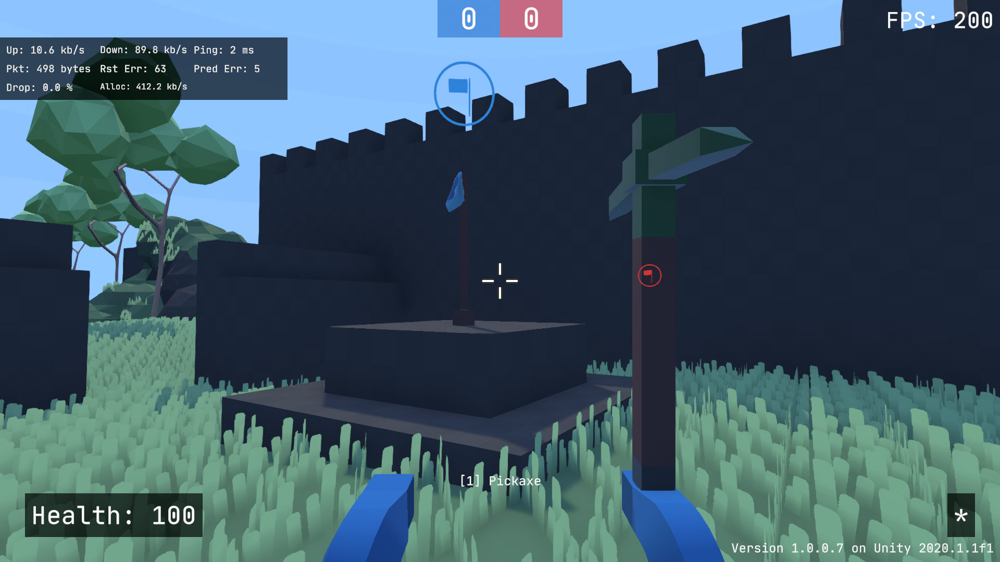
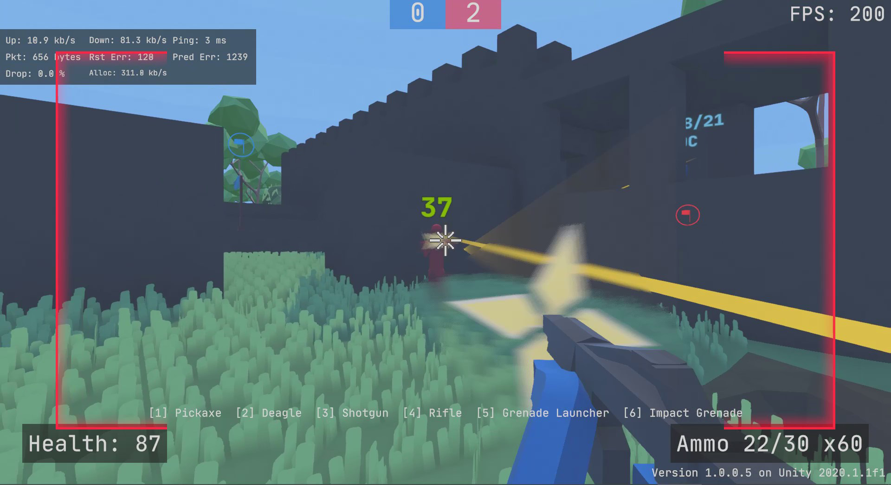

# Voxelfield

Voxelfield is a multiplayer shooter game where the terrain is completely destructible.

Video: https://youtu.be/m-gB7DvBCo4




### Technical details
- Written in C# using the Unity game engine and LiteNetLib networking library
- Authoritative network model supporting 16 players with 120 packets per second
- Custom hybrid ECS system to ensure determinism
- Integration with AWS GameLift, authentication with Steam API, stat tracking with AWS DynamoDB

This is by far my biggest project, `cloc` output (counts lines of code):

```
-------------------------------------------------------------------------------
Language                     files          blank        comment           code
-------------------------------------------------------------------------------
C#                             218           3221           4791          19558
-------------------------------------------------------------------------------
```

### Code Layout
Modularity is achieved using Unity packages and assembly definitions

Voxelfield Specific Scripts:
- [Voxels](Assets/Scripts/Voxels)
  - [Chunk](Assets/Scripts/Voxels/Chunk.cs)
  - [ChunkManager](Assets/Scripts/Voxels/ChunkManager.cs)
  - [MapManager](Assets/Scripts/Voxels/Map/MapManager.cs)
  - [Rendering](Assets/Scripts/Voxels/VoxelRenderer.cs)
- [Voxelfield](Assets/Scripts/Voxelfield)
  - [Components](Assets/Scripts/Voxelfield/Session/Components.cs)

FPS General Packages:
- [Session](Packages/Swihoni.Sessions) - Modifying the game, clients, servers
  - [Server](Packages/Swihoni.Sessions/Runtime/Server.cs)
  - [Client](Packages/Swihoni.Sessions/Runtime/Client.cs)
  - [Client Prediction](Packages/Swihoni.Sessions/Runtime/ClientPrediction.cs)
  - [Common Session Components](Packages/Swihoni.Sessions/Runtime/Components/SessionComponents.cs)
  - [Common Player Components](Packages/Swihoni.Sessions/Runtime/Player/Components/PlayerComponents.cs)
- [Component](Packages/Swihoni.Components) - Defining game data
- [LiteNetLib](Packages/LiteNetLib) - Forked networking library by [RevenantX](https://github.com/RevenantX/LiteNetLib)


### Gamemodes
- CTF (Capture the Flag)
- Secure Area
- Deathmatch

### Weapons
- Rifle
- Deagle
- Sniper
- Grenade Launcher
  - Missile Launcher
- Sand Bomb
- C4
- Grenade
- Molotov
- Shotgun
- Pickaxe
- Pistol
- SMG
- Impact Grenade
- Boomstick
- Flashbang
